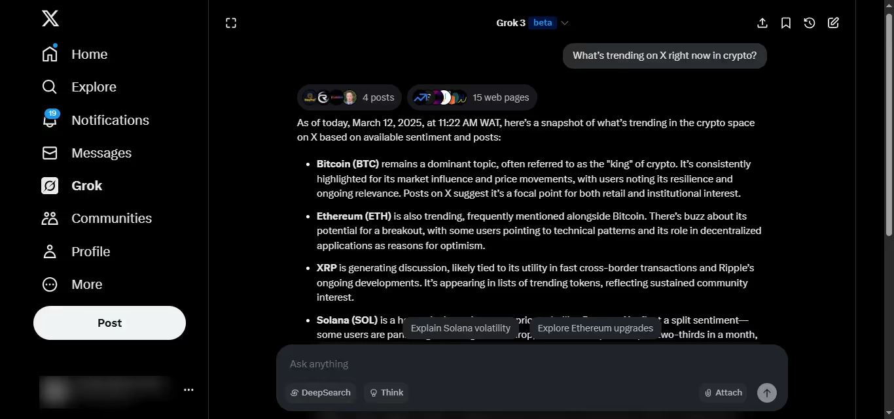

# Grok 使用指南：普通人也能玩转的 AI 聊天工具

你可能听说过 ChatGPT，但 Grok 是个什么东西？简单说，它是马斯克搞的 AI 聊天工具，最大的特点是能实时联网查信息，而且还挺有个性——有时候会开玩笑，有时候还会怼你两句。如果你想找个既能干活又有点意思的 AI 助手，接着往下看就对了。

---

## 谁能用 Grok？怎么开始用？

理论上，只要你有 X（就是以前的 Twitter）账号，就能用 Grok。但有个小问题：免费用户只能用基础版，功能受限；想要完整体验最新的 Grok 3，得开通 X Premium 会员。

**具体怎么用：**

1. **在 X 上用**：打开 X 的 app，侧边栏里找到 Grok，点进去就能开聊。
2. **用独立 app**：美国的 iPhone 用户可以下载 Grok 的独立 app，用 X 账号登录就行。

开通会员后，你能无限制地用 Grok，还能体验最新功能。免费用户嘛，就只能凑合着用基础版了。

## Grok 能帮你做什么？

别把 Grok 当成只会回答问题的机器人。它其实能干不少事：

- **查实时信息** – 最新新闻、热点话题、事实核查，随时问随时答
- **帮你写东西** – 推文、标题、博客灵感、广告文案都能生成
- **学习和研究** – 总结文章、解释概念、帮你理清思路
- **编程支持** – 写代码、找 bug，支持 Python、JavaScript 等语言
- **头脑风暴** – 公司名、产品创意、故事灵感，想到哪问到哪

你就当它是个随叫随到的助手，有什么需求直接说就行。如果你经常需要快速获取信息或者生成内容，👉 [这个工具可能更适合长期使用](https://shaoyumi.com/buy/66)，稳定性和响应速度都有保障。

## 几个实用的 Grok 提问技巧

想让 Grok 给出更好的回答？关键在于你怎么问。下面这些例子可以直接套用，把 [方括号里的内容] 换成你自己的需求就行。

**查最新消息：**
- "总结一下今天 [科技/商业/体育] 领域的热点新闻"
- "X 上现在 [你关心的话题] 都在聊什么？"
- "最近关于 [某个事件或公司] 有什么新动态？"

**社交媒体内容：**
- "写一条关于 [周一/咖啡/工作] 的推文，要能引起互动"
- "帮我写个关于 [你的话题] 的推特长贴"
- "给我 5 条适合 [旅行/健身/励志] 主题的 Instagram 文案"

**学习和研究：**
- "用小学生能听懂的话解释一下 [区块链/量子物理/人工智能]"
- "总结这篇文章：[粘贴链接或内容]"
- "用简单的话列出 [你的话题] 的优缺点"

**商业和营销：**
- "给我 3 个 2024 年真正靠谱的线上副业思路"
- "帮我写一段有说服力的 [你的产品] 产品描述"
- "我的 [业务类型] 怎么才能提高销量？"

**编程和技术：**
- "这段 Python 代码有问题，帮我修一下：[粘贴代码]"
- "解释一下这个错误信息是什么意思，怎么修：[粘贴错误]"
- "写一段简单的 [JavaScript/Python] 脚本，功能是 [具体任务]"

**娱乐和创意：**
- "用一句话吐槽一下 AI"
- "用讽刺的语气回答'AI 会取代人类吗？'"
- "讲个关于 [你喜欢的话题] 的笑话"

问得越具体，答案越靠谱。多试几次你就知道怎么问最有效了。

## Grok 的两种性格模式

Grok 不是那种一本正经的聊天机器人——它有性格。你可以根据需求调整它的回答风格。

**两种模式：**

1. **标准模式** – 直接给信息，适合研究、编程、正经事
2. **趣味模式** – 加点幽默、讽刺、随性的语气，适合社交媒体、段子、娱乐

## Grok 和 ChatGPT 比，谁更好用？

两个都很强，但各有长处。

**Grok 的优势：**
- 能实时联网 – 可以查最新新闻和热点话题
- 更有个性 – 会开玩笑、会讽刺，聊天更自然
- 集成在 X 里 – 社交媒体用户用起来很方便

**ChatGPT 的优势：**
- 回答更有条理 – 适合深度解释和研究
- 写作能力更强 – 长文内容写得更好
- 使用范围更广 – 独立工具，集成场景更多

**怎么选？** 如果你要快速、有趣、实时的信息，选 Grok。如果需要详细、有条理的回答，ChatGPT 更合适。

## 用 Grok 写东西和创作内容

Grok 不只是聊天工具——它还能帮你写各种内容。无论是推文、博客灵感还是广告文案，Grok 都能搞定。

**怎么用 Grok 写作：**
- **推文和社交媒体** – "写一条关于 [你的话题] 的推文，要能吸引互动"
- **博客灵感** – "给我 5 个关于 [你的领域] 的博客选题"
- **产品描述** – "帮我写一段有说服力的 [你的产品] 产品描述"
- **广告文案** – "写一段简短有吸引力的 [你的服务] 广告"
- **邮件写作** – "写一封关于 [你的话题] 的友好但专业的邮件"

**几个小技巧：**
- 明确说出你要的语气（搞笑、严肃、有说服力）
- 加上受众信息（比如"要让自由职业者有共鸣"）
- 如果回答不满意，直接让 Grok 换个风格重写

不管是发社交媒体、写邮件还是头脑风暴，Grok 都能让你快速搞定。

## 用 Grok 写代码和解决技术问题

Grok 可以帮你写代码、找 bug、用简单的话解释技术概念。不管你是新手还是老手，它都能提高效率。

**怎么用 Grok 编程：**
- **修复错误** – "这段 Python 代码跑不通，找找问题：[粘贴代码]"
- **生成脚本** – "写一段简单的 [JavaScript/Python] 脚本，功能是 [具体任务]"
- **解释概念** – "这个错误信息是什么意思？[粘贴错误信息]"
- **优化代码** – "让这段代码更高效：[粘贴代码]"
- **学习新语言** – "Python 和 JavaScript 有什么区别？"

**局限性：**
- Grok 适合基础编程帮助，但处理不了太复杂的任务
- AI 生成的代码不一定完美，正式用之前最好自己检查一遍

如果你需要快速解决方案、调试帮助或者代码解释，Grok 是个不错的工具。

## 用 Grok 学习和研究

Grok 可以总结、解释、拆解复杂话题，让它们变得容易理解。不管你是在学习、核查事实还是单纯好奇，都可以这么用。

**怎么用 Grok 学习：**
- **总结文章和书** – "总结这篇文章：[粘贴链接或内容]"
- **解释难懂的话题** – "用小孩能听懂的话解释 [量子物理/区块链]"
- **对比概念** – "[两个话题] 有什么区别？"
- **提炼要点** – "从 [一本书/一个话题] 里提炼出 3 个最重要的观点"
- **翻译或简化文本** – "把这段话改成简单易懂的版本：[粘贴文本]"

**最适合的场景：**
- **学生** – 快速解释、研究总结、学习指南
- **职场人士** – 行业洞察、报告总结、商业趋势
- **随便学点什么的人** – 有趣的事实、历史、科学，或者任何你好奇的东西

Grok 让学习变得更简单更快——直接问，它就给答案。

## Grok 的实时联网功能是什么意思？

和大多数 AI 聊天机器人不同，Grok 能从互联网上抓取实时数据，这意味着它给出的答案是最新的，而不是只靠过去训练的知识。

**这对你意味着什么：**
- **更新鲜的新闻和热点** – 获取科技、商业、体育等领域的实时更新
- **更好的事实核查** – 让 Grok 帮你验证信息、对比来源
- **更相关的答案** – 因为它能浏览网页，回答会更贴近当下

**局限性：**
- 实时数据不等于 100% 准确——重要信息还是要自己再核实
- 有些话题可能有冲突或有偏见的来源，需要批判性思考

如果你需要最新的信息而不是过时的 AI 回答，👉 [Grok 确实是个靠谱的选择](https://shaoyumi.com/buy/66)，尤其是在需要实时响应的场景下。

## Grok 的局限性（它做不到的事）

Grok 很强，但不是万能的。有些事情它还是搞不定或者做得不太好。

**Grok 做不到的事：**
- **长篇详细内容** – 适合快速回答，但不适合深度研究或长文写作
- **100% 准确** – 即使能实时联网，也可能出错。重要信息一定要再核实
- **复杂的编程方案** – 能帮忙调试和写小脚本，但不适合高级编程任务
- **情感智能** – 它有性格，但不是真的"理解"情绪
- **离线工作** – 必须连着 X（Twitter）或 Grok app 才能用

Grok 有趣、快速、实用，但不能完全替代深度研究或人类专业知识。

## 像高手一样用 Grok 的几个技巧

想要更好的答案、更快的响应、更有用的见解？这些方法能让你把 Grok 用得更顺手。

**1. 提问要具体**
- 别问"给我讲讲 AI"，试试"解释一下 AI 现在在营销领域怎么用"
- 别说"帮我写条推文"，试试"写一条关于周一的搞笑推文，带点科技元素"

**2. 用追问来优化答案**
- 如果第一次回答不够好，让它重写或者补充细节
- 比如："简短一点。""现在，改成讽刺的语气。"

**3. 试试不同的性格模式**
- 标准模式用来查资料和研究
- 趣味模式用来搞笑、讽刺、随便聊

**4. 让它给多个选项**
- "给我 5 个关于 [话题] 的推文创意"
- "列出 3 种改进我的 [业务/学习习惯/锻炼计划] 的方法"

**5. 别完全相信它**
- Grok 快、有趣，但不是永远正确
- 重要信息一定要自己再核实

用对方法，Grok 就能成为你工作、创作和学习的好帮手。

---

## 最后说两句：值得开始用 Grok 吗？

Grok 快、有趣，而且一直在进步。如果你本来就在用 X（Twitter），那值得试试——尤其是如果你喜欢实时信息、机智回答和更像人的 AI。

免费用户能用基础版，功能有限；如果你有 X Premium，就能体验完整版的 Grok 3。

随着独立 app、语音模式、特斯拉集成等新功能的推出，Grok 只会越来越好用。

**总结一下？** 如果你经常用 X，Grok 是个不错的 AI 工具。如果不怎么用 X，那可以等它扩展到更多平台再说。对于需要稳定、高效的 AI 工具的用户来说，👉 [选择一个长期可靠的方案](https://shaoyumi.com/buy/66) 可能更适合你的实际使用场景。
